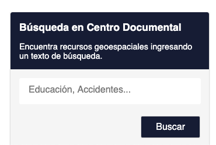

## Cedoc Widget

Permite añadir un widget a cualquier sitio web, donde el usuario pueda ingresar un texto de búsqueda para el Centro Documental.

El archivo "example.html", contiene un ejemplo de uso del widget.



### Instalación

Descargar el archivo "cedoc-widget.css".

Descargar el archivo "cedoc-widget.js"

En nuestro archivo html, en donde se va a insertar el widget, debemos:

1) Importar nuestro archivo de estilos dentro de la etiqueta `head`

```html
<head>
	(...)
	<link rel="stylesheet" href="cedoc-widget.css">
	(...)
</head>
```

2) Añadir nuestro elemento dentro de las etiquetas `<body></body>`

```html
<div id="cedoc-widget"></div>
```

3) Importar nuestro archivo javascript antes de la etiqueda `</body>`

```html
<script src="cedoc-widget.js"></script>
```

4) Crear una sección de script utilizando las etiquetas `<script></script>`, esto se debe insertar después del código del paso 2. Dentro de las etiquedas, iniciamos nuestro widget.

```html
<script>
	cedocWidget.init({
		url: [url_centro_documental]
	});
</script>
```

### Configuración

Para el paso 4, al iniciar nuestro widget, se aceptan 5 propiedades, una obligatoria y cuatro opcionales.

| Propiedad   | Requerido | Descripción                                                                                               | Valor por defecto                                                 |
|-------------|-----------|-----------------------------------------------------------------------------------------------------------|-------------------------------------------------------------------|
| url         | Si        | URL del Centro Documental a utilizar                                                                      | No posee                                                          |
| instance    | No        | Instancia particular en que se desea realizar la búsqueda, si no se ingresa busca en todas las instancias | Todas las instancias                                              |
| title       | No        | Título presente en el widget                                                                              | Búsqueda en Centro Documental                                     |
| subtitle    | No        | Subtítulo presente en el widget                                                                           | Encuentra recursos geoespaciales ingresando un texto de búsqueda. |
| placeholder | No        | Placeholder del input de búsqueda                                                                         | Educación, Accidentes...                                          |

##### Ejemplo

```html
<script>
	cedocWidget.init({
		url: 'http://centrodocumental.ide.geonodosoft.cl',
		instance: 'mineduc',
		title: 'Buscar en Centro Documental Mineduc',
		subtitle: 'Disponemos de más de 10.000 recursos!',
		palceholder: 'Ingrese un texto'
	});
</script>
```

### Iframe

Para usar como iframe, primero debe almacenar el proyecto en una dirección accesible por el sitio web en que se requiera insertar el ifreme, puede ser en una carpeta contenida en el sitio web, o en un servidor web. Luego, se debe hacer la llamada al archivo "iframe.html".

Ejemplo en uso local:

```html
<iframe style="border: none" height="300px" width="300px" src="iframe.html" frameborder="0"></iframe>
```

Ejemplo realizando la llamada al sitio en un servidor web externo.

** Para este caso utilizamos github pages **

```html
<iframe style="border: none" height="300px" width="300px" src="https://biosoftcl.github.io/cedoc-widget/iframe.html" frameborder="0"></iframe>
```

En el archivo iframe.html, es posible realizar la configuración de los parámetros que soporta el widget.


